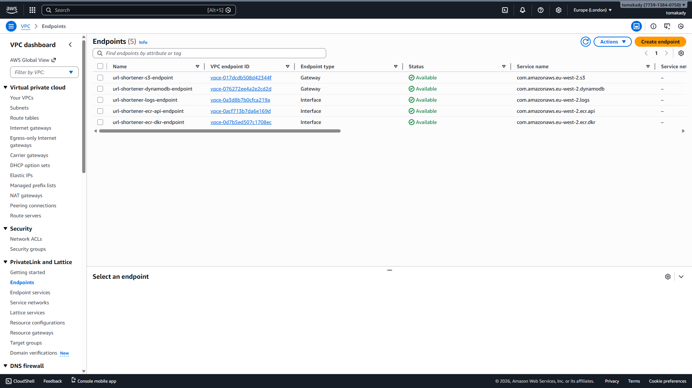

# URL Shortener ECS

A URL shortener service deployed on AWS ECS with blue/green deployments, WAF protection, and automated CI/CD.

## Quick Start

### Base URL
```
https://url.shortener.tomakady.com
```

### Shorten a URL

```bash
curl -X POST https://url.shortener.tomakady.com/shorten \
  -H "Content-Type: application/json" \
  -d '{"url": "https://www.youtube.com/watch?v=5PApp6ksmiw"}'
```

**Response:**
```json
{
  "short": "a1b2c3d4",
  "url": "https://www.youtube.com/watch?v=5PApp6ksmiw"
}
```

### Use the Short URL

Visit in browser or use curl:
```
https://url.shortener.tomakady.com/a1b2c3d4
```

This redirects to the original URL.

### Health Check

```bash
curl https://url.shortener.tomakady.com/healthz
```

## API Endpoints

- `POST /shorten` - Create a short URL
  - Body: `{"url": "https://example.com"}`
  - Returns: `{"short": "code", "url": "original"}`

- `GET /{short_id}` - Redirect to original URL
  - Returns: HTTP 302 redirect

- `GET /healthz` - Health check
  - Returns: `{"status": "ok", "ts": timestamp, "version": "1.0"}`

## Example

```bash
# Shorten a URL
curl -X POST https://url.shortener.tomakady.com/shorten \
  -H "Content-Type: application/json" \
  -d '{"url": "https://github.com"}'

# Use the returned short code
# Visit: https://url.shortener.tomakady.com/{short_code}
```

## Screenshots

### OIDC role trust policy


### CodeDeploy canary deployment


### WAF associated to ALB


### VPC Endpoints


## Decisions & trade-offs

- **VPC endpoints instead of NAT** – Tasks in private subnets reach S3, DynamoDB, ECR, and CloudWatch Logs via VPC endpoints. No NAT gateways; lower cost and simpler networking, at the cost of managing endpoint quotas and service coverage.
- **OIDC for GitHub Actions** – CI/CD uses OIDC to assume an IAM role instead of long-lived AWS keys. No secrets to rotate or leak; requires the OIDC provider and trust policy to be set up once in the global backend.
- **CodeDeploy blue/green** – Canary traffic shifting and automatic rollback on failed health checks. More moving parts (two target groups, listener managed by CodeDeploy) and a longer deploy than all-at-once, but safer rollouts.
- **WAF on the ALB** – Web ACL in front of the ALB for managed rules. Adds latency and cost per request; trade-off is acceptable for a public-facing service.
- **Terraform `ignore_changes`** – Listener default action and ECS service task definition are ignored so CodeDeploy and the deploy pipeline own traffic and task definition updates. Terraform stays the source of truth for everything else.

## Instructions

### Run locally
```bash
cd app
pip install -r requirements.txt
export TABLE_NAME=url-shortener   # or your DynamoDB table name
uvicorn src.main:app --reload --port 8080
```
Requires AWS credentials and a DynamoDB table (or use LocalStack).

### Deploy from scratch
1. **Bootstrap backend** – In `infra/global/backend`: copy `terraform.tfvars.example` to `terraform.tfvars`, set `github_repo`, then `terraform init` and `terraform apply`. Add the role ARN output to GitHub repo secret `AWS_ROLE_ARN`.
2. **Deploy dev** – In `infra/envs/dev`: configure backend (e.g. S3 bucket, DynamoDB lock table from step 1), then `terraform init` and `terraform apply`.
3. **App deploys** – Push to `main`; Build and Push to ECR and Terraform Deploy workflows run. CodeDeploy handles blue/green.

### Teardown
```bash
cd infra/envs/dev
terraform destroy -auto-approve
```
Tear down when done to avoid ongoing cost (ALB, WAF, DynamoDB, etc.). Global backend (S3, DynamoDB lock, OIDC) is separate; destroy only if you no longer need it.
